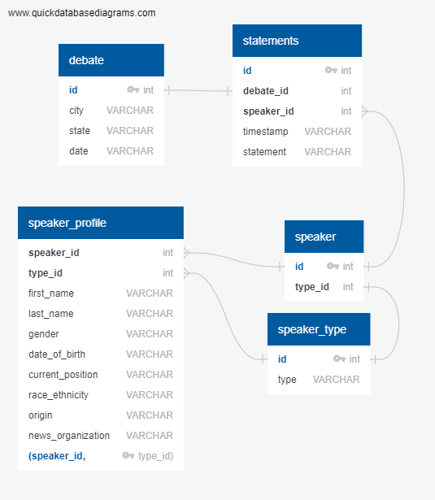

# ETL

Normalization of transcript csv files to be loaded into a SQL database.

## Standardizing Transcripts

Transcripts of the Democratic debates are available on rev.com, however the names of the speakers are not consistent throughout multiple debates. Here we take the transcripts, standardize the naming convention across the debates, and load the data into a SQL database via postgres.

## Schema/Table Breakdown

Since all of the data started out in one format, it needed to be broken out into multiple tables to make it cleaner, more useable and create new fields that would allow the data to be more useful. The idea was to be able to query against information from all of the debates, and all of the candidates. So the tables that needed to hold the most information would be surrounding the speakers in the debates and the statements each speaker made during the debates. That lead to a table with all the statements made during all the debates and a table with profile details on all the speakers (candidates and proctors). There then had to be a way to identify aspects of the statements. There needed to be a debate table, to decipher which of the 4 debates (across 6 dates) each statement was made; there needed to be a speaker table to identify who was making each statement; and there needed to be a speaker type table to indentify if the speaker was a candidate or a proctor. These were split out to save processing time by simply having ID numbers in the larger statements table, but can easily be joined together to query against (see ERD image).

## How the Project Works

Given `debate_url` to a transcript of the democratic debate, the function `scrape_prep(debate_url)` in  scrape_tools.py scrapes the url to generate the `name_map.json` file containing a list of speakers and scrapes the [2020 Democratic Debates wikipedia](https://en.wikipedia.org/wiki/2020_Democratic_Party_presidential_debates_and_forums) to generate lists of candiates and proctors.

`name_map.json` contains names as shown on rev.com where the user manually enter names for remapping.

Running the code in `profiles.ipynb` takes `candidates.txt` and `proctors.txt` and generates [candidate_profiles.json](https://github.com/phamkdaniel/ETL/blob/master/Resources/candidate_profiles.json) and  [proctor_profiles.json](https://github.com/phamkdaniel/ETL/blob/master/Resources/proctor_profiles.json) to store the respective profiles from wikipedia, which the user manually inputs. We included age, race/ethnicity, gender, position, and location/origin data in the profiles because we think these are important categories for grouping data. The profiles contain data which relies on some subjective decisions on the "position" field but generally the most recent elected or government office of the candidate was used. For candidates without government experience we used the terms "businessperson" or "author". 

Then the user runs `process_debate(debate_url, debate, night)` to create the csv files for each transcript.

The code in `transform_load.ipynb` takes the datasets and loads them into a database based on relations defined in `schema.sql`.

## File Breakdown

* profiles.ipynb - reads candidates.txt and proctors.txt to generate empty dictionaries to store profile information
* Resources - folder containing csv files of transcripts from the democratic debates, txt files containing candidates and proctors, and json files containing the profiles for candidates and proctors
* schema.sql - schema for creating tables in SQL datbase
* scrape_tools.py - functions to scrape rev.com
* rev_scrape.py - file to execute scrape
* transform_load.ipynb - takes transcript csv and profile json files and loads them into a PostgreSQL database based on tables in schema.sql
* queries.sql - list of various sql queries that extract relevant information from joining the various tables

## Dependencies

* [psycopg2](https://pypi.org/project/psycopg2/)
* [sqlalchemy](https://www.sqlalchemy.org/)
